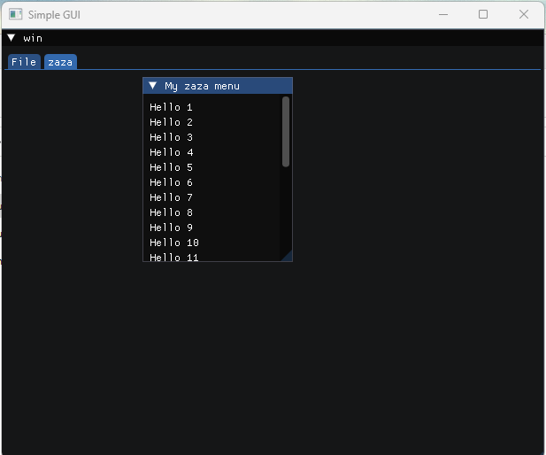

#### UPDATED VERISON / BETTER GUI

SOURCE CODE FOR UPDATED VERISON HERE: https://github.com/DanielOrourke02/Password-Generator

# Usage

You can build the tool in visual studio OR run the pre built exe in releases

### This is my first GUI! Its very bad I know!

# Preview

[.gif)](https://www.youtube.com/watch?v=m4cp0uQON50)

<h3 align="left">Connect with me:</h3>

<h3 align="left">Hire Me: https://discord.gg/kNWkT8xWg6 Or DM ME: mal023</h3>

  
  
  
  
  
  

